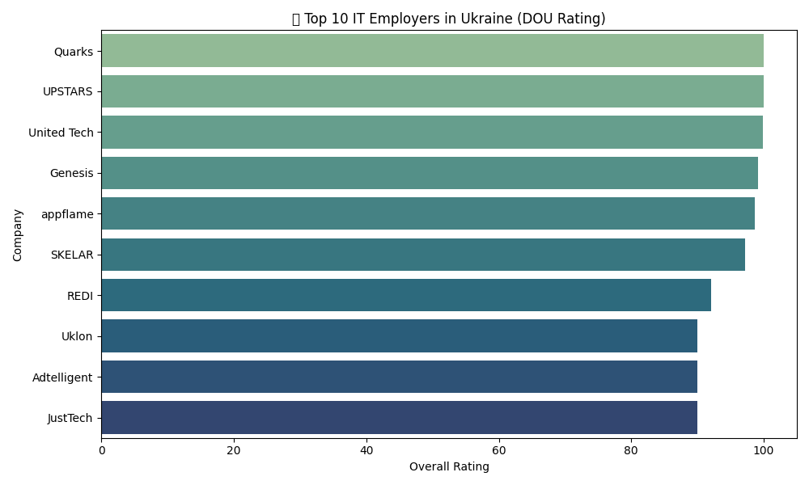
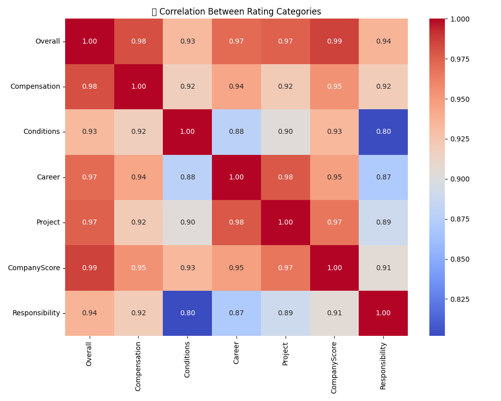
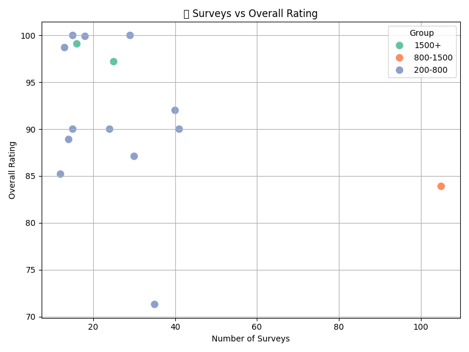
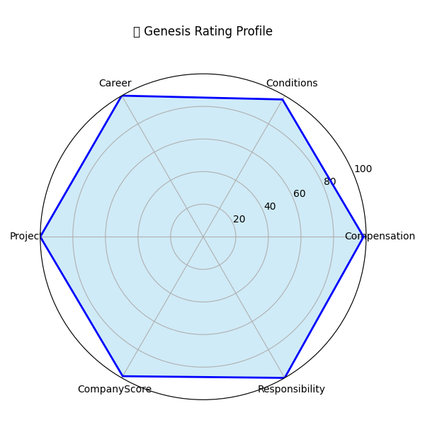

# My DOU IT Employer Rating Analysis

[](https://www.python.org/)
[](https://pandas.pydata.org/)
[](https://matplotlib.org/)
[](https://seaborn.pydata.org/)
[](https://numpy.org/)
[](https://opensource.org/licenses/MIT)


A data analysis project based on the DOU.ua.  
Visualizes trends, correlations, and standout companies in the Ukrainian tech market.

## 📊 Features

- Top 10 companies by overall rating
- Correlation between rating categories
- Survey count vs rating scatter plot
- Radar chart for individual company profiles


## 🚀 Getting Started

### 1. Clone the repository

```bash
git clone https://github.com/your-username/dou_employer_rating_analysis.git
cd dou_employer_rating_analysis
```
### 2. Install dependencies
```
pip install -r requirements.txt
```
### 3. Run the analysis
```
python analysis.py
```

### 📈 Output Charts
- charts/top10_overall.png — Top 10 companies by rating- 
- charts/category_correlation.png — Correlation heatmap- 
- charts/surveys_vs_rating.png — Scatter plot- 
- charts/genesis_radar.png — Radar chart for Genesis

### 🛠️ Technologies Used
- Python
- Pandas
- Matplotlib
- Seaborn
- NumPy

## 📈 Sample Visualizations

### 🏆 Top 10 IT Employers by Overall Rating


### 📊 Correlation Between Rating Categories


### 📈 Surveys vs Overall Rating


### 📌 Genesis Rating Profile



### ✅ Author

Made by Serhii — QA Engineer & Data Enthusiast GitHub